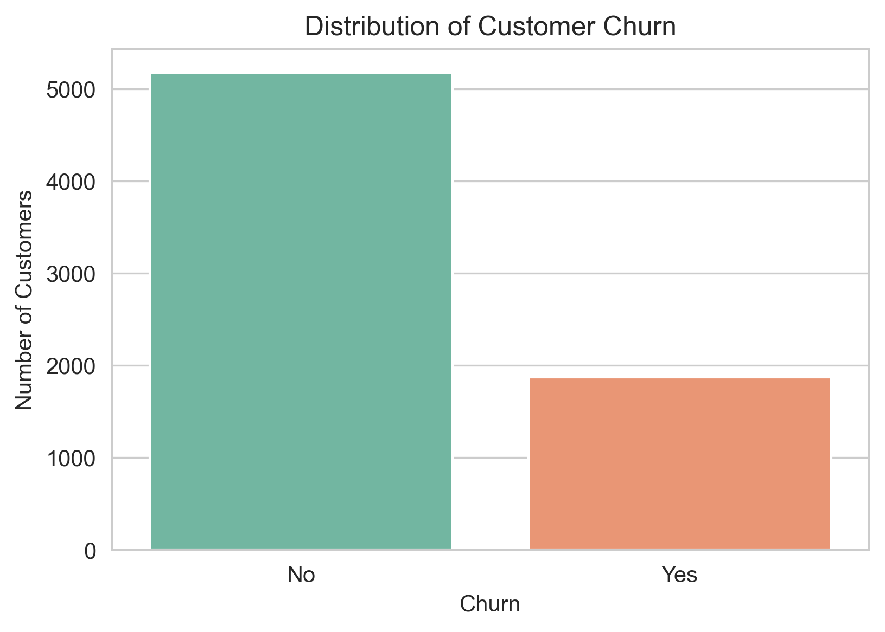
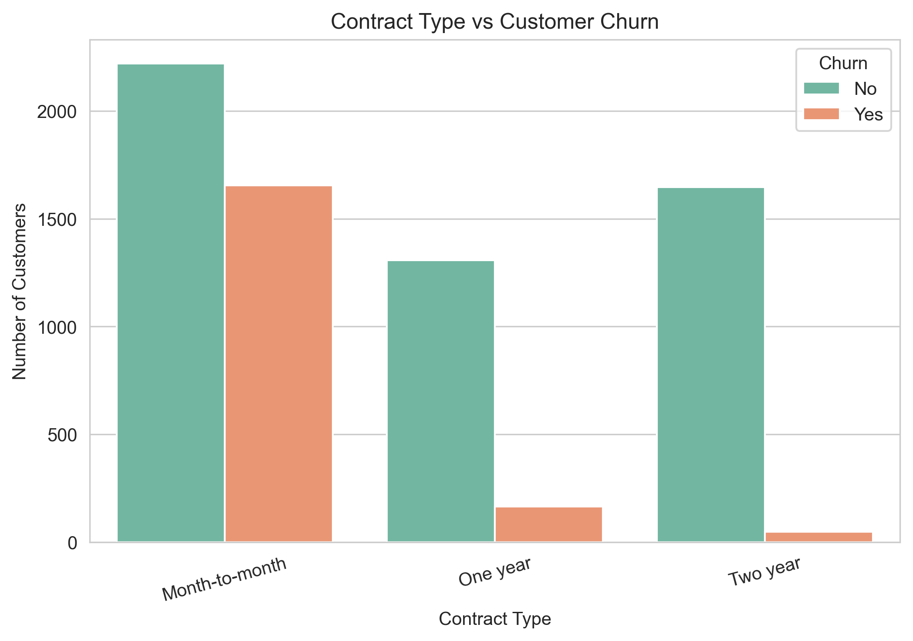
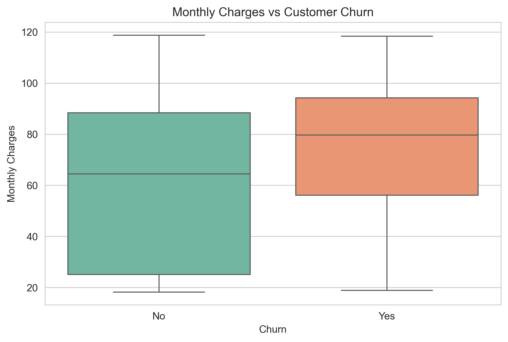
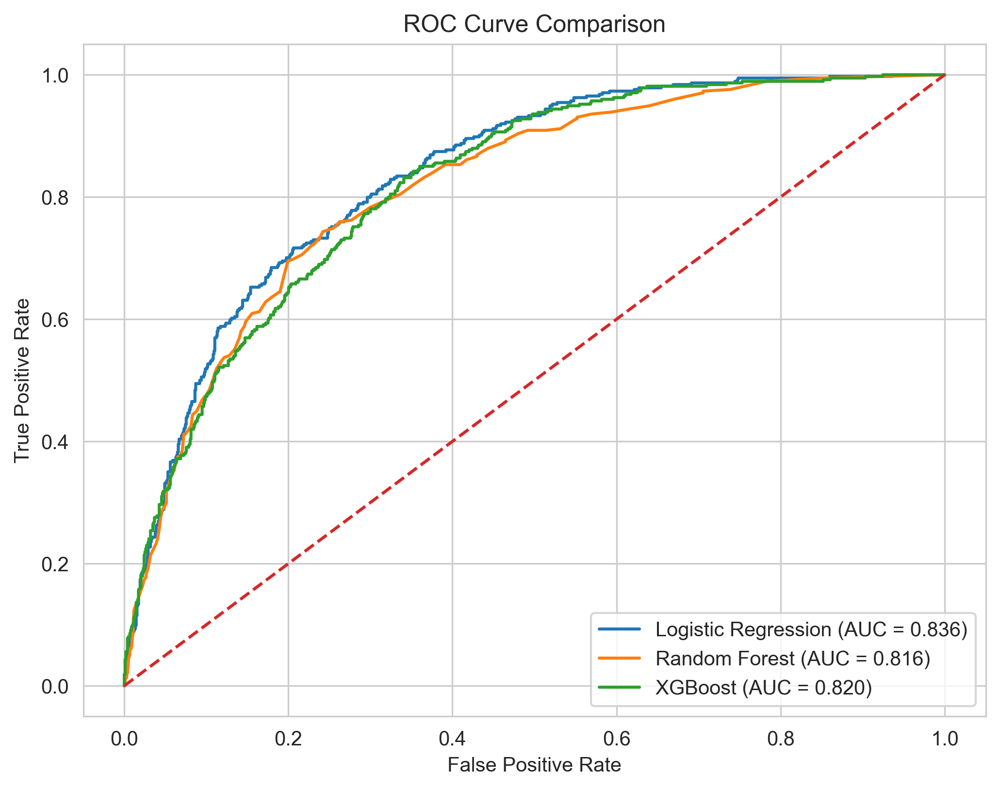
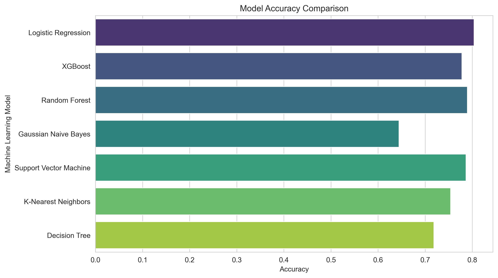

### Customer Churn Prediction using Machine Learning

#### Project Overview

Customer churn prediction is one of the most important applications of machine learning in customer relationship management. Identifying customers who are likely to discontinue a service enables organizations to implement targeted retention strategies, improve customer satisfaction, and reduce revenue loss.

This project develops an end-to-end supervised machine learning pipeline using the IBM Telco Customer Churn dataset. The workflow includes data exploration, data preprocessing, exploratory data analysis (EDA), feature engineering, model development, model evaluation, hyperparameter tuning, feature interpretation, and model persistence.

---

#### Business Problem

Customer retention is significantly more cost-effective than customer acquisition. Organizations need reliable methods to identify customers who are at risk of leaving so that proactive retention strategies can be implemented.

The objective of this project is to build a machine learning classification model capable of predicting customer churn using demographic information, subscribed services, account details, and billing history.

---

#### Objectives

* Perform comprehensive data exploration and preprocessing.
* Conduct exploratory data analysis (EDA) to understand customer behavior.
* Build multiple machine learning classification models.
* Compare model performance using multiple evaluation metrics.
* Select the best-performing model.
* Optimize the selected model using hyperparameter tuning.
* Interpret the model to identify key business drivers of customer churn.
* Save the trained model for future inference and deployment.

---

#### Dataset

**Dataset:** IBM Telco Customer Churn Dataset

**Total Records:** 7,043

**Total Features:** 21

**Target Variable:** Churn

The dataset contains customer demographic information, subscribed services, billing details, contract information, payment methods, and customer churn status.

---

#### Technologies Used

* Python
* Pandas
* NumPy
* Matplotlib
* Seaborn
* Scikit-learn
* XGBoost
* Joblib
* Jupyter Notebook

---

#### Project Workflow

1. Import Libraries
2. Load the Dataset
3. Explore the Dataset
4. Data Cleaning and Preprocessing
5. Exploratory Data Analysis (EDA)
6. Feature Engineering
7. Train-Test Split
8. Feature Scaling
9. Model Building and Evaluation
10. Model Performance Comparison
11. Best Model Selection
12. Hyperparameter Tuning
13. Feature Interpretation
14. Save the Final Model
15. Project Summary
16. Conclusion

---

#### Project Structure

```text
Customer_Churn_Prediction/
│
├── data/
│   └── Telco-Customer-Churn.csv
│
├── notebook/
│   └── Customer_Churn_Prediction.ipynb
│
├── images/
│   ├── churn_distribution.png
│   ├── contract_vs_churn.png
│   ├── monthly_charges_distribution.png
│   ├── monthly_charges_vs_churn.png
│   ├── tenure_distribution.png
│   ├── tenure_vs_churn.png
│   ├── correlation_heatmap.png
│   ├── model_accuracy_comparison.png
│   ├── model_precision_comparison.png
│   ├── model_recall_comparison.png
│   ├── model_f1_score_comparison.png
│   ├── roc_curve_comparison.png
│   └── feature_importance.png
│
├── models/
│   ├── customer_churn_logistic_regression_model.pkl
│   └── customer_churn_standard_scaler.pkl
│
├── results/
│   └── model_comparison.csv
│
├── requirements.txt
├── README.md
└── .gitignore
```

---

### Sample Visualizations

#### Churn Distribution



---

#### Contract Type vs Customer Churn



---

#### Monthly Charges vs Customer Churn



---

#### ROC Curve Comparison



---

#### Model Performance Comparison



---
---

### Machine Learning Models Evaluated

The following supervised machine learning algorithms were implemented and evaluated:

* Logistic Regression
* Decision Tree Classifier
* Random Forest Classifier
* K-Nearest Neighbors (KNN)
* Support Vector Machine (SVM)
* Gaussian Naive Bayes
* XGBoost Classifier

---

### Model Performance Summary

| Model                     |   Accuracy |  Precision |     Recall |   F1-Score |
| :------------------------ | ---------: | ---------: | ---------: | ---------: |
| Logistic Regression       | **80.38%** | **64.76%** | **57.49%** | **60.91%** |
| Random Forest             |     78.96% |     62.58% |     51.87% |     56.73% |
| XGBoost                   |     77.83% |     58.91% |     54.81% |     56.79% |
| K-Nearest Neighbors (KNN) |     75.41% |     53.74% |     53.74% |     53.74% |
| Decision Tree             |     71.86% |     47.01% |     46.26% |     46.63% |
| Gaussian Naive Bayes      |     64.46% |     41.84% | **86.36%** |     56.37% |

The baseline **Logistic Regression** model achieved the best overall balance of Accuracy, Precision, Recall, and F1-Score. Although hyperparameter tuning was performed using GridSearchCV, the tuned model did not outperform the baseline model on the test dataset. Therefore, the baseline Logistic Regression model was selected as the final model.

---

### Key Business Insights

* Customers with **month-to-month contracts** were significantly more likely to churn than customers with long-term contracts.
* Customers using **Fiber Optic Internet Service** showed a higher likelihood of churn.
* **Electronic Check** was the payment method most strongly associated with customer churn.
* Customers with **longer tenure** demonstrated much higher retention rates.
* Customers subscribed to **Online Security** and **Tech Support** services were less likely to churn.
* The trained model can help organizations identify high-risk customers and support proactive customer retention strategies.

---

### How to Run the Project

#### 1. Clone the Repository

```bash
git clone https://github.com/pratapds/customer-churn-prediction.git
```

#### 2. Navigate to the Project Directory

```bash
cd customer-churn-prediction
```

#### 3. Install the Required Libraries

```bash
pip install -r requirements.txt
```

#### 4. Launch Jupyter Notebook

```bash
jupyter notebook
```

#### 5. Open the Notebook

Navigate to the `notebook` folder and open:

```text
Customer_Churn_Prediction.ipynb
```

Run all cells sequentially from top to bottom to reproduce the complete analysis, visualizations, model training, evaluation, and saved artifacts.

---

#### Results

* Successfully developed an end-to-end customer churn prediction pipeline.
* Evaluated seven supervised machine learning classification models.
* Compared models using Accuracy, Precision, Recall, and F1-Score.
* Performed hyperparameter tuning using GridSearchCV.
* Identified the most influential features contributing to customer churn.
* Saved the trained Logistic Regression model and StandardScaler for future inference.

---

#### Future Enhancements

* Apply feature selection techniques to reduce model complexity.
* Investigate class imbalance methods such as SMOTE.
* Explore ensemble and stacking techniques.
* Perform advanced hyperparameter optimization.
* Deploy the trained model using Flask, FastAPI, or Streamlit.
* Build an interactive dashboard for real-time churn prediction and business insights.

---

#### Author

**Pratap N**

Data Science | Machine Learning | Deep Learning Enthusiast

If you found this project interesting, consider giving the repository a ⭐ on GitHub.
